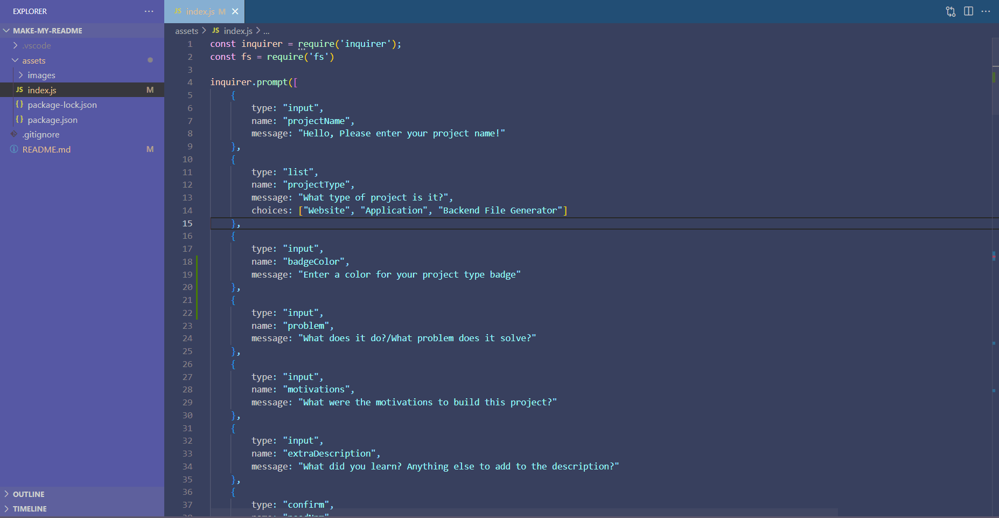
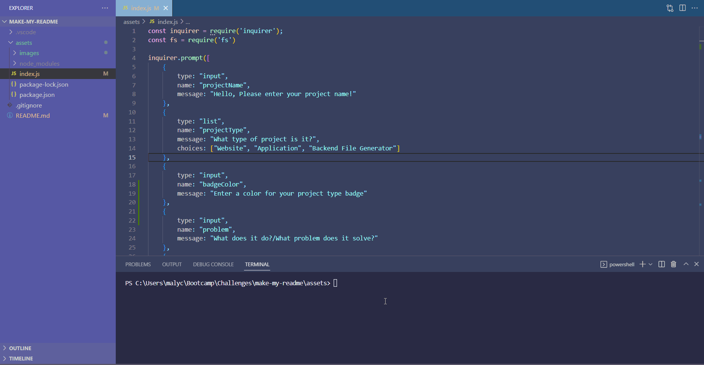

# make-my-README  
        
## Description
        

It is meant to automatically create a professional README from the given user input. Writting a README is for me, and many others, not our  favorite task. A generator like this one helps making it much faster by automizing most of the process. This project helped me learn more about inquirer and asynchronicity.

## Table of Contents
- [Installation](#installation)
- [Usage](#usage)
- [License](#license)
- [Credit](#credit)
- [Test](#test)
- [Contributing](#contributing)
- [Questions](#questions)

## Installation

If the folder contains a package.json with dependencies listed and/or package-lock.json file, simply enter 'npm install' in the terminal.
If none of those files are available or there aren't any dependencies listed in the package.json make sure to follow these steps:

1. type 'npm init' into the terminal
2. type 'npm package-name@version' for each package listed below:

-inquirer@8.2.4

## Usage

To use the generator, make sure to install the apropriate npm package as instructed in the installation instructions part. Then type 'node index.js' into the terminal an answer all the questions as shown in the gif below.

## License

## Credit

N/A

## Test

N/A

## Contributing

N/A

## Questions

Find me on GitHub: https://github.com/Mayalynn96

Or email me at: mayalynncohen@gmail.com